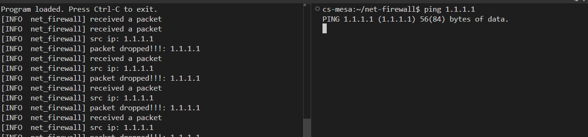

# net-firewall

A simple eBPF-based firewall built with [aya-rs](https://github.com/aya-rs/aya).  
It inspects packets at the XDP layer and drops packets originating from IPs specified in user space.

## How It Works

- The **user space** program populates a blocklist with IP addresses.
- The **kernel space** eBPF program uses this blocklist to decide whether to drop or pass incoming packets.


## Features

- Drops packets from user-defined IP addresses.
- Runs at the XDP layer (high-performance packet filtering).
- Configurable network interface.
- Built entirely in Rust using aya.

  
## Prerequisites

1. stable rust toolchains: `rustup toolchain install stable`
1. nightly rust toolchains: `rustup toolchain install nightly --component rust-src`
1. (if cross-compiling) rustup target: `rustup target add ${ARCH}-unknown-linux-musl`
1. (if cross-compiling) LLVM: (e.g.) `brew install llvm` (on macOS)
1. (if cross-compiling) C toolchain: (e.g.) [`brew install filosottile/musl-cross/musl-cross`](https://github.com/FiloSottile/homebrew-musl-cross) (on macOS)
1. bpf-linker: `cargo install bpf-linker` (`--no-default-features` on macOS)

## Build & Run

Use `cargo build`, `cargo check`, etc. as normal. Run your program with:

```shell
cargo run --release --config 'target."cfg(all())".runner="sudo -E"'
```

Cargo build scripts are used to automatically build the eBPF correctly and include it in the
program.

## Demo
 
run the binary with logs enabled
```shell
RUST_LOG=info cargo run --release --config 'target."cfg(all())".runner="sudo -E"'
```

